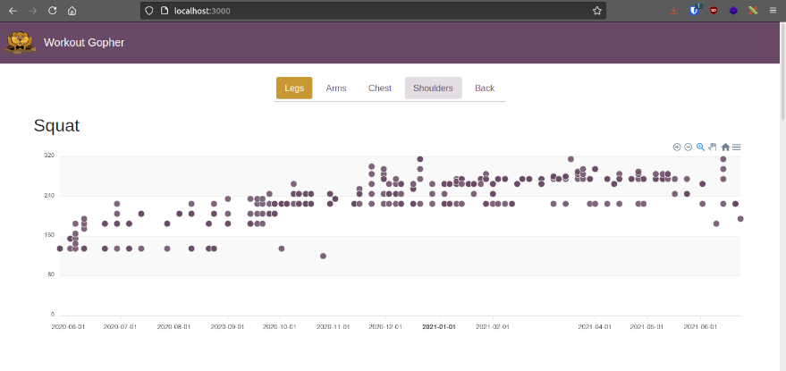

## Workout Gopher

Workout Gopher is a Vue app that reads exercise history from a Google Sheet and graphs it via [ApexCharts](https://apexcharts.com/).

### Usage

**Google Sheet format** - must enter data as follows
|     Date   | Exercise  | Sets | | | |
| -------------- | -------------- | ---- | - | - | - |
| 2000-01-01    | Bench  | 135x5 | 135x5 | 135x5 | ...can have arbitrary amount of sets |
| 2000-01-01    | Shoulder Press  | 135x5 | 135x5 | 135x5 | ... |

**Config** - You will need to customize the values in `src/config/config.js` to match your Google Sheet info.  The Google Sheet will also need to be viewable publicly. 

**Running** - This uses Vue 3 and [Vite](https://vitejs.dev/), you have the following npm commands
 - `npm run dev` - hot reload dev server on port 3000 
 - `npm run build` - production export in `/dist/`

### Screenshot

